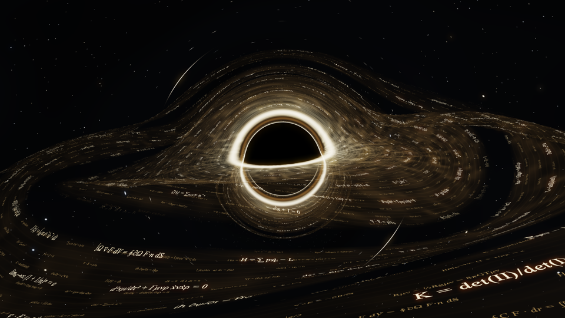

**中文** | [English](README.en.md)

# 壁纸库 · WallpaperUI

macOS 15+ 原生 SwiftUI 动态壁纸库：把视频和 Wallpaper Engine 场景放进同一个图库，选中就能设为桌面动态背景。

[](LICENSE)


> **状态：0.2.73 预览版。** 主要功能可用，但有些能力还没做完实机验收，边界写在「已知限制」里。
> 仓库以源码为主；已构建的应用包请到 [Releases](https://github.com/CChen1532/wallpaper-library/releases) 下载（仅 Apple 芯片，ad-hoc 签名、未公证，首次打开要右键 →「打开」）。仓库里不含壁纸素材、场景包和第三方运行时。
> 也可以一条命令装：`brew install --cask CChen1532/tap/wallpaperui`（[homebrew-tap](https://github.com/CChen1532/homebrew-tap)）。



## 功能

- 统一图库：场景与视频合并为「全部壁纸」，可以登记多个目录、自动识别内容、统一搜索与排序，每张壁纸的设置各存一份。
- 自动发现：应用启动时和之后每 60 秒扫一次素材目录，串行调度、增量缓存；新发现的素材不会自动播放。
- 场景壁纸：自研 `WESceneCore` 解析 Wallpaper Engine 场景格式，渲染交给随应用打包的 Mirage Scene 运行时。它会预备首帧、后台加载、保证单实例、跟随显示器，并在停止、退出或睡眠时清理。
- 场景播放控制：每张场景可以单独设帧率上限、音量与静音、0.25 到 2 倍动画速度、裁切模式与位置、暂停／继续（⌘⌥P）、渲染比例／MetalFX／MSAA、电池与温控节能、前台遮挡暂停、媒体信息与封面、作者自定义效果与快捷入口，以及 PNG／JSON 导出和备份后重置。改正在播放的那张壁纸时，命令走 Mirage 控制通道直接生效，不会重启渲染器。
- 播放显示器：每张场景可以跟随当前显示器，也可以固定在某一台。屏幕断开时回退到可用屏幕，重新连上后自动返回。
- 大场景包：解除了 UI 端 128 MiB 与桥接器 256 MiB 的准入限制，改用有界索引检查，不再复制整个包。
- 视频壁纸：通过 `WallpaperBackend` 协议调用已有后端播放 MP4。导入会复制文件，重名跳过，删除移入废纸篓。
- Space 过渡底图：从当前渲染画面生成一张静帧，在系统 Space 切换动画期间顶住画面（默认关闭，带 macOS 版本结构护栏）。
- 引力之旅：内置原生 Metal 场景，一个不做交互的金色丝绸公式盘，有「极致画质」（4K 目标）和「性能优先」两版。
- SELENE 月下观测台：另一个内置场景，NASA 原始月球地形配本地时钟、固定光照和 4096 阴影贴图，鼠标可以旋转和缩放，平时缓慢自转。
- 动画封面：卡片直接播放素材自带的 GIF、APNG 或多帧 WebP，单张 JPG／PNG 保持静止。远程封面只取受信任的 Steam 域名，更新上限 30 Hz，滚出屏幕或开了「减少动态效果」就停下。
- 原生界面：macOS 侧栏、工具栏、详情面板与语义色，跟随系统浅色／深色；卡片悬停、选中与重排都有短过渡，并遵守系统「减少动态效果」。

## 系统要求

- macOS 15.0 或更高版本
- 构建需要 Swift 5.9+ / Apple Command Line Tools（SwiftUI 部分不依赖外部包）
- 构建完整应用还需要可用的 Mirage Scene 运行时（GPL-3.0，见下）

## 从源码构建

```sh
git clone https://github.com/CChen1532/wallpaper-library.git
cd WallpaperUI

# 场景渲染器源码（GPL-3.0，约 700 MB），只有构建完整应用时才需要
git submodule update --init ThirdParty/MirageWallpaper

# 准备并打包应用
bash scripts/build-app.sh

# 核心自检
bash scripts/check.sh
```

构建产物写入 `dist/`，中间缓存写入 `.build/`，两者都不入库。应用使用本地 ad-hoc 签名，尚未公证。

## 使用

- 单击视频卡片，在详情区点「设为动态壁纸」，视频就会在桌面背景播放；底部有上一段、随机、下一段。
- 选中场景后，右侧详情直接显示鼠标交互、点击响应和 30／60／120 Hz；「播放与声音」里可以调帧率、画面位置、播放显示器（跟随或固定）、场景声音和音频响应，另外还有「画质」「自动控制与媒体」等折叠组。设置按素材分别保存。
- 如果选中的正是当前播放的壁纸，改完会出现「应用到此壁纸」；编辑别的壁纸不会重启当前场景。
- 侧栏「设置」或 ⌘, 只管应用外观和关于信息；自动轮播在侧栏另有一个设置页。
- View 菜单可以在紧凑窗口（980×680）和标准窗口（1200×800）之间切换；选中卡片后用方向键切换选择，⌘Return 把选中的视频设为桌面壁纸。
- 「停止」保留轮播（定时任务可能再次播放），「全部关闭」会连轮播一起关掉。
- 缩略图缓存放在 `~/Library/Caches/WallpaperUI/Thumbnails`。

## 目录结构

| 路径 | 内容 |
| --- | --- |
| `Sources/WallpaperUI/` | SwiftUI 界面、图库模型、后端与协调器 |
| `Sources/WESceneCore/` | Wallpaper Engine 场景格式解析、合成与离线验收核心 |
| `Sources/MirageSceneBridge/` | 场景运行时桥接与焦点显示器选择 |
| `Sources/GravitySceneCore/`、`Sources/GravitySceneRenderer/` | 引力之旅场景定义与 Metal 渲染器 |
| `Sources/WESceneVisibleProbe/`、`WESceneDesktopProbe/`、`MirageSceneBridgeProbe/` | 可见画面、桌面层级与桥接探针 |
| `Tests/` | 独立 Swift 断言程序（本机 Command Line Tools 环境跑不了 XCTest） |
| `scripts/` | 构建、打包与 20+ 项检查脚本 |
| `工具/` | 场景探针、快速切换底图、性能与视差诊断等辅助工具 |
| `Scenes/GravityJourney/` | 内置原生场景（极致／性能两版） |
| `Resources/` | `Info.plist` 与应用图标 |
| `patches/` | 对 Mirage 渲染器的补丁（GPL-3.0 上游） |

## 常用验证

```sh
bash scripts/check.sh                     # 核心与后端边界
bash scripts/check-scene-playback.sh      # 场景播放交接
bash scripts/check-unified-library.sh     # 统一图库与素材发现
bash scripts/check-gallery-navigation.sh  # 图库导航与输入策略
bash scripts/check-renderer-features.sh   # 场景渲染器功能与偏好迁移
bash scripts/check-localization.sh        # 界面本地化覆盖
python3 scripts/check-scene-input.py      # 场景输入接线
bash scripts/check.sh --live              # 读取真实素材（不改变播放状态）
```

`--live` 会读取真实素材并写入缩略图缓存，不改变播放状态；`--media` 会在临时目录里生成微型视频，用来测试导入、缓存、坏文件和删除流程。

## 已知限制

- 场景能力仍不完整：自定义图片／纹理、应用与文件快捷方式、系统媒体信息已在 0.2.41 接入，但依赖素材自己的绑定，而且只做过可控输入和单个场景的验证；作者分组与条件显示仍未完整还原。多屏热插拔、Space 切换与长时稳定性都还没做实机验收。
- Space 切换：系统动画期间仍可能短暂露出系统壁纸，当前做法是用静帧顶住过渡（默认关闭）。系统私有的墙纸结构可能随 macOS 版本变化。
- 性能：引力极致版的 4K／120 FPS 是目标值，不是实测结果，所测机器没达到；界面设置读取做过优化，这不代表整帧渲染性能。
- 视频后端：第三方 `phonto` / `phonto-wall`。仓库源码不含它，Releases 里的预编译包带了一份便携副本。作者本机改过它电池供电时的暂停行为，这个补丁不随本仓库发布。桌面播放和应用内预览是两回事，本版没有应用内播放器。
- 轮播：本机脚本的 `rotate on` 只传间隔不传模式，所以 UI 只开放随机轮播。
- 符号链接和素材目录之外的路径不能直接播放或删除；既有素材只扫描小写 `.mp4`。
- 不支持开机启动。

## 第三方与许可

- 本项目源码采用 MIT 许可，见 [LICENSE](LICENSE)。
- [MirageWallpaper](https://github.com/laobamac/MirageWallpaper)（GPL-3.0）以 Git 子模块方式引用，代码不随本仓库分发；构建完整应用时请自行获取，届时该运行时适用它的 GPL-3.0 条款。`patches/` 里放的是针对它的修改补丁。
- 视频后端 `phonto` / `phonto-wall` 是第三方工具（GPL-3.0），本仓库源码不含；Releases 里的预编译包带便携副本，并额外带一份 CPython 运行时，好让没有开发环境的机器直接运行。
- 场景格式实现参考公开的逆向资料与格式说明；GPL 参考实现只作黑盒对照，没有复制其代码。
- 本仓库不含任何壁纸素材、Wallpaper Engine 场景包、字体或商业资源，与 Wallpaper Engine、Steam 及其发行方没有隶属关系。
- 动态壁纸会持续解码视频或渲染场景，增加耗电与发热；修改桌面壁纸设置属于自担风险的操作。

## 免责声明

本软件按「原样」提供，不附带任何担保，使用风险自负。完整版本见 [DISCLAIMER.md](DISCLAIMER.md)。

- 与 Wallpaper Engine、Steam、Valve 及其发行方没有隶属或背书关系。
- 会读写 macOS 桌面壁纸相关设置，其中包含未公开的私有结构；系统升级或其他壁纸应用都可能让它失效，改动前请自行备份。
- 本仓库不含任何壁纸素材、场景包、字体或商业资源，导入内容的授权由你自己确认。
- 创意工坊下载会在本机运行 Valve 的 steamcmd，并用你自己的 Steam 账号登录；密码不保存、不上传，使用时需遵守 Steam 的条款。
- 发布包使用本地自签名、未经过 Apple 公证，绕过 Gatekeeper 的后果由你承担。
- 动态壁纸会持续解码视频或渲染场景，耗电与发热都会增加。
- 请不要在 Issue 或讨论区粘贴账号、密码或含个人信息的日志。

## 鸣谢

这个应用能跑起来，靠的是下面这些人和项目。

- [MirageWallpaper](https://github.com/laobamac/MirageWallpaper)：Wallpaper Engine 场景的渲染运行时，GPL-3.0 授权，随应用一起打包。没有它，场景壁纸就只是一堆解析出来的 JSON。
- `phonto` / `phonto-wall`：视频壁纸的后端，桌面上的 MP4 由它播放。仓库源码不含它，预编译包里带的是便携副本；自己从源码构建时要另行准备。
- 随包分发的开源库：FFmpeg、MoltenVK、Vulkan loader、freetype、fontconfig、libpng、lz4、dav1d、gettext，以及预编译包里的 CPython 运行时。场景运行时的许可文本在 `WallpaperUI.app/Contents/Resources/SceneRuntime/Contents/Resources/Licenses/`，便携工具与 Python 的许可文本在 `WallpaperUI.app/Contents/Resources/Licenses/`。
- Wallpaper Engine 的场景格式，以及围绕它做逆向整理的社区。这里的格式细节是从公开资料里一点点对出来的，有错欢迎指正。
- Apple 的 SwiftUI、Metal、MetalFX 与 AVFoundation：界面、渲染和音视频解码都建立在这些框架上。

如果上面漏了谁，或者哪条署名写错了，开个 Issue 说一声。

## 文档

- [开发计划](开发计划.md)：当前版本状态、待办与验证入口
- [项目精简总览](项目精简总览.md)：研发历程与已确认结论的浓缩版
- [state.example.json](state.example.json)：脱敏后的状态样例

> 研发过程中产生的 100 份阶段报告／试验记录未收录进本仓库，只在作者本地保留；上表中标注「未收录」的引用因此点不开。

## 反馈

欢迎通过 Issues 报告问题或提出想法。请附上 macOS 版本、素材类型（视频／场景）以及最小复现步骤。
